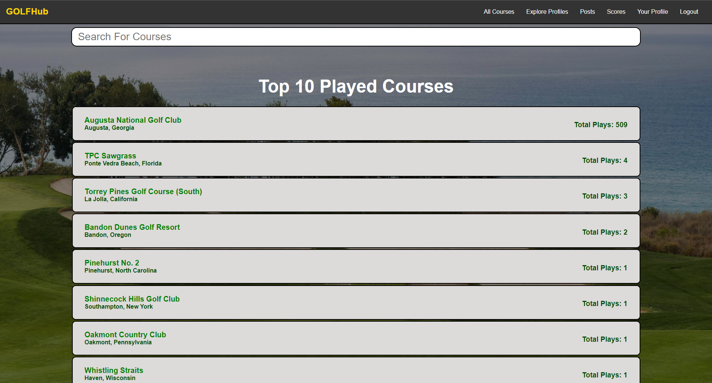
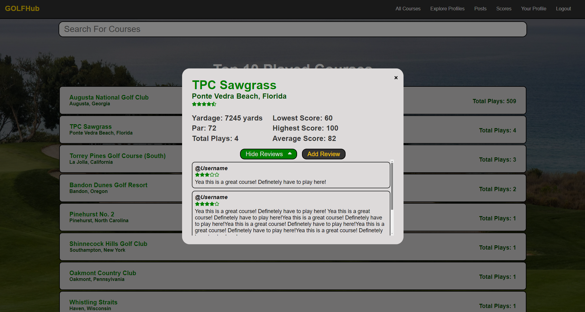
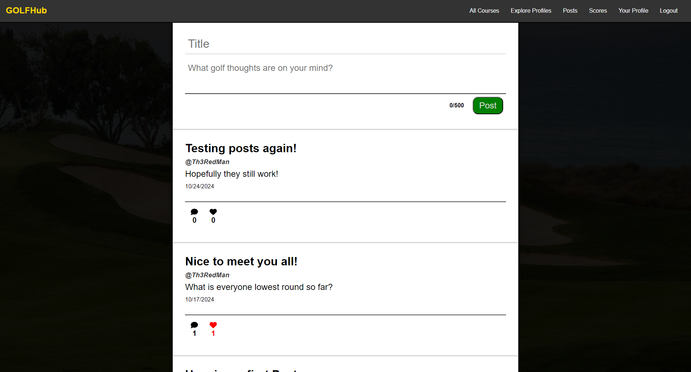
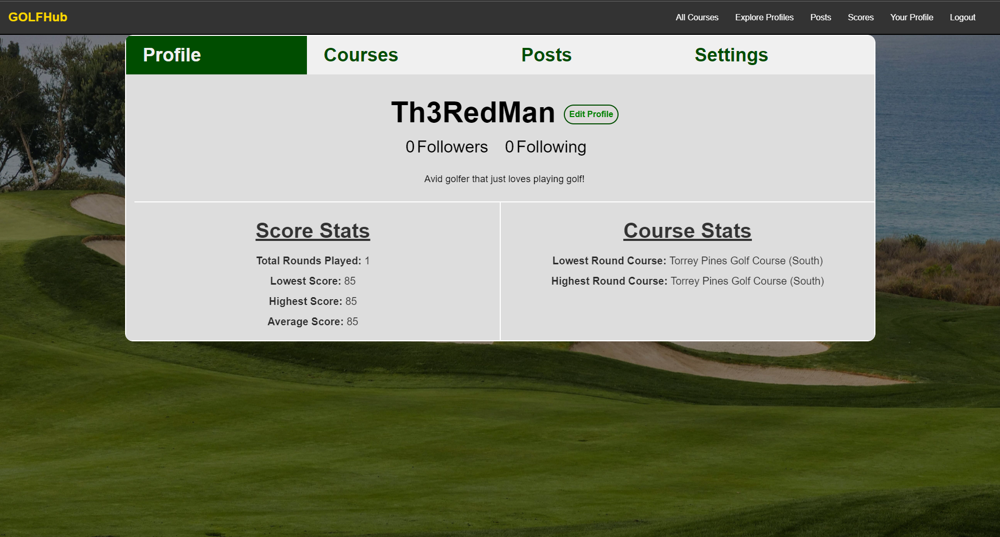

# GolfHub

**GolfHub** is a nice golf social media platform where golfers can track their stats, discover and browse courses, follow other people, and share their golf thoughts through posts. This projcet is currently in progress as not all functionality has been implemented yet.

## In Progress

- **Responsive:** Currently the website is only designed for large monitors as this still needs to be implemented.
- **Course Reviews:** Eventually people will be able to add their reviews to each course, for now, there are just placeholder reviews.
- **Profile Settings:** Currently there are no settings in the profile such as changing email/password.

## Features

- **User Authentication**: Sign up and login securely to your account.
- **Track Golf Stats**: Track stats like high and low scores, total rounds played, different courses played, and more!
- **Course Browsing**: Search and find new golf courses worldwide. If you don't find one you're looking for, you can always add any course yourself!
- **Follow and Connect**: You can follow other golfers, browse their posts, and track their stats along with them.
- **Create and Share Posts**: Share your golf thoughts and scores through custom posts. Other people can like and comment each post as well.

## Tech Stack

- **Frontend**:
  - React
  - TypeScript
  - JavaScript
  - SCSS
- **Backend**:
  - Express.js
  - MongoDB
  - Node.js

## Server Repository

The server's repository can be found in my GitHub repositories or at this link: https://github.com/DevParkerCS/GolfSocialServer

## Gallery

